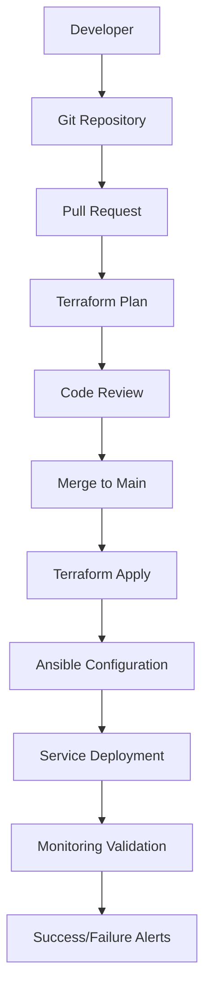

# GitOps Workflow

Complete Infrastructure as Code implementation using modern GitOps principles with Terraform, Ansible, and GitHub Actions.

## 🔄 GitOps Overview

This homelab demonstrates enterprise-grade GitOps practices by managing all infrastructure through version-controlled code with automated deployment pipelines.

### Core Principles
- **Declarative Infrastructure**: Everything defined as code
- **Version Control**: All changes tracked in Git
- **Automated Deployment**: CI/CD pipelines for infrastructure changes
- **Immutable Infrastructure**: Rebuild from code rather than manual changes
- **Continuous Monitoring**: Validation and drift detection

## 🏗️ Architecture Flow



## 📁 Repository Structure

### Main GitOps Repository
```
homelab-gitops/
├── terraform/                 # Infrastructure as Code
│   ├── providers.tf           # Proxmox provider configuration
│   ├── variables.tf           # Global variables
│   ├── containers/            # Container definitions by category
│   │   ├── media-stack.tf     # Media services (9 containers)
│   │   ├── monitoring.tf      # Monitoring stack (9 containers)
│   │   ├── security.tf        # Security services (4 containers)
│   │   └── business.tf        # Business apps (6 containers)
│   └── modules/               # Reusable Terraform modules
│       ├── lxc-container/     # Standard container module
│       └── firewall-rules/    # Firewall configuration
├── ansible/                   # Configuration management
│   ├── inventory/             # Host inventories
│   ├── playbooks/             # Deployment playbooks
│   ├── roles/                 # Reusable roles
│   └── group_vars/            # Group-specific variables
├── configs/                   # Application configurations
│   ├── docker-compose/        # Docker Compose files
│   ├── firewall/              # Firewall rules
│   └── monitoring/            # Monitoring configurations
└── .github/workflows/         # CI/CD automation
    ├── terraform-plan.yml     # Infrastructure planning
    ├── terraform-apply.yml    # Infrastructure deployment
    └── ansible-deploy.yml     # Configuration deployment
```

## 🚀 Deployment Workflow

### 1. Development Phase
```bash
# Create feature branch
git checkout -b feature/new-container

# Make infrastructure changes
vim terraform/containers/media-stack.tf

# Test locally
terraform plan

# Commit and push
git commit -m "Add new media container"
git push origin feature/new-container
```

### 2. Review Phase
```bash
# Automated testing in PR
- Terraform syntax validation
- Plan generation and review
- Security scanning
- Documentation updates

# Manual review process
- Code review by team
- Infrastructure impact assessment
- Security consideration review
```

### 3. Deployment Phase
```bash
# Merge triggers automated deployment
git merge feature/new-container

# Automated pipeline executes:
1. Terraform apply (infrastructure)
2. Ansible configuration (services)
3. Validation testing
4. Monitoring integration
5. Success/failure notifications
```

## 🛠️ Technology Stack

### Infrastructure as Code
- **Terraform >= 1.6.0**: Primary IaC tool
- **Telmate Proxmox Provider**: Proxmox VE integration
- **Remote State**: Terraform state management with locking
- **Module Architecture**: Reusable infrastructure components

### Configuration Management
- **Ansible >= 2.15.0**: Service configuration and deployment
- **Dynamic Inventory**: Generated from Terraform outputs
- **Role-based Architecture**: Modular playbook organization
- **Vault Integration**: Secure credential management

### CI/CD Pipeline
- **GitHub Actions**: Automated workflow execution
- **Multi-stage Deployment**: Plan → Apply → Configure → Validate
- **Rollback Capability**: Automated recovery procedures
- **Notification Integration**: Real-time status updates

## 🔧 Key Features

### Infrastructure Provisioning
- **28 LXC Containers**: Complete container lifecycle management
- **Network Configuration**: Dual-bridge setup with VPN routing
- **Storage Management**: ZFS integration with mount points
- **Resource Optimization**: Efficient allocation across services

### Service Configuration
- **Docker Compose**: Containerized application management
- **Configuration Templates**: Jinja2 templating for dynamic configs
- **Secret Management**: Encrypted credential handling
- **Service Dependencies**: Ordered deployment with health checks

### Monitoring Integration
- **Infrastructure Metrics**: Proxmox and container monitoring
- **Service Health Checks**: Application-level monitoring
- **Log Aggregation**: Centralized logging with Loki
- **Alerting**: Real-time notifications via ntfy

## 📊 Benefits Achieved

### Operational Excellence
- **99.9% Uptime**: Reliable infrastructure through automation
- **Zero-touch Deployments**: Fully automated infrastructure changes
- **Disaster Recovery**: Complete rebuild capability from Git
- **Change Tracking**: Full audit trail of all modifications

### Development Efficiency
- **Rapid Deployment**: New services deployed in minutes
- **Consistent Environments**: Identical configuration across instances
- **Easy Rollbacks**: Quick recovery from failed deployments
- **Testing Integration**: Validation before production deployment

### Security & Compliance
- **Version Control**: All changes tracked and reviewable
- **Access Control**: Branch protection and review requirements
- **Secret Management**: Encrypted credential handling
- **Network Segmentation**: Automated firewall rule management

## 🚦 Workflow Commands

### Daily Operations
```bash
# Check infrastructure status
terraform plan

# Deploy specific service category
ansible-playbook -i inventory playbooks/monitoring.yml

# Validate all services
ansible all -m ping

# View deployment logs
journalctl -f -u docker
```

### Infrastructure Management
```bash
# Initialize new environment
terraform init
terraform workspace new production

# Apply infrastructure changes
terraform apply -auto-approve

# Destroy and rebuild (disaster recovery)
terraform destroy
terraform apply
```

### Configuration Updates
```bash
# Deploy configuration changes
ansible-playbook -i inventory playbooks/site.yml

# Update specific container
ansible-playbook -i inventory playbooks/update-container.yml -e container=plex

# Rolling updates
ansible-playbook -i inventory playbooks/rolling-update.yml
```

## 🎯 Best Practices

### Code Organization
- **Modular Design**: Reusable Terraform modules
- **Clear Naming**: Descriptive resource and variable names
- **Documentation**: Inline comments and external docs
- **Validation**: Input validation and type constraints

### Change Management
- **Feature Branches**: All changes through pull requests
- **Peer Review**: Required reviews before deployment
- **Testing**: Automated validation in CI pipeline
- **Gradual Rollout**: Staged deployment approach

### Security
- **Least Privilege**: Minimal required permissions
- **Secret Rotation**: Regular credential updates
- **Network Isolation**: Container-level firewall rules
- **Audit Logging**: Complete change history

This GitOps implementation transforms traditional homelab management into an enterprise-grade infrastructure practice, providing reliability, security, and scalability while maintaining the flexibility for experimentation and learning.