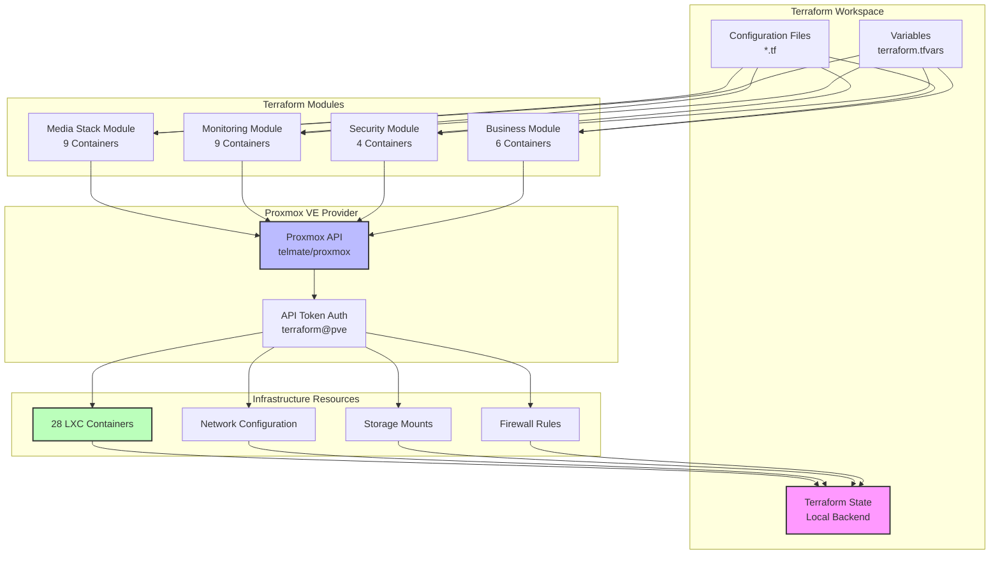
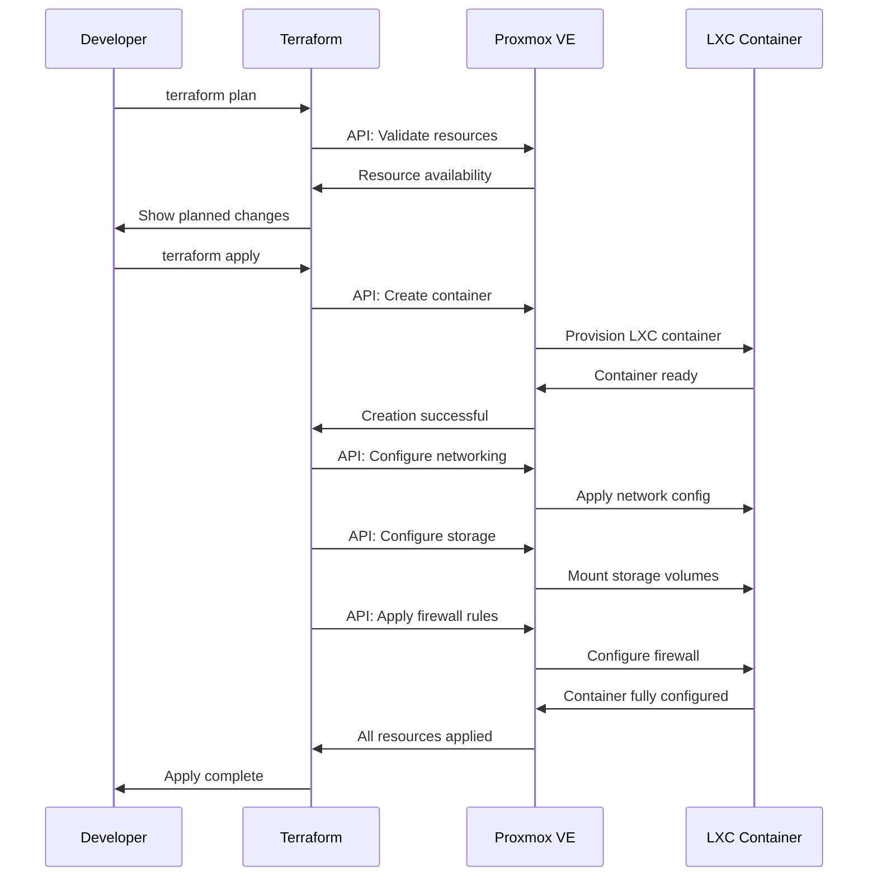

# Terraform Infrastructure

Complete Infrastructure as Code implementation using Terraform to manage all 28 LXC containers and their resources on Proxmox VE.

## 🏗️ Terraform Architecture



## 📁 File Structure

### Repository Organization
```
terraform/
├── main.tf                    # Main configuration entry point
├── providers.tf               # Provider configurations
├── variables.tf               # Global variable definitions
├── outputs.tf                 # Output values for Ansible
├── terraform.tfvars           # Environment-specific values
│
├── containers/                # Container definitions by category
│   ├── media-stack.tf         # Media services (9 containers)
│   ├── monitoring.tf          # Monitoring stack (9 containers)
│   ├── security.tf            # Security services (4 containers)
│   └── business.tf            # Business apps (6 containers)
│
├── modules/                   # Reusable modules
│   ├── lxc-container/         # Standard LXC container module
│   │   ├── main.tf
│   │   ├── variables.tf
│   │   └── outputs.tf
│   └── firewall-rules/        # Firewall rule module
│       ├── main.tf
│       ├── variables.tf
│       └── outputs.tf
│
└── environments/              # Environment-specific configs
    ├── production/
    ├── staging/
    └── development/
```

## ⚙️ Provider Configuration

### Proxmox Provider Setup
```hcl
# providers.tf
terraform {
  required_version = ">= 1.6.0"
  
  required_providers {
    proxmox = {
      source  = "telmate/proxmox"
      version = "~> 3.0"
    }
  }
  
  backend "local" {
    path = "terraform.tfstate"
  }
}

provider "proxmox" {
  pm_api_url          = var.proxmox_api_url
  pm_api_token_id     = var.proxmox_api_token_id
  pm_api_token_secret = var.proxmox_api_token_secret
  pm_tls_insecure     = true
  pm_parallel         = 10
  pm_timeout          = 600
}
```

### Variable Configuration
```hcl
# variables.tf
variable "proxmox_api_url" {
  description = "Proxmox VE API endpoint"
  type        = string
  validation {
    condition     = can(regex("^https?://", var.proxmox_api_url))
    error_message = "API URL must be a valid HTTP/HTTPS endpoint."
  }
}

variable "proxmox_api_token_id" {
  description = "Proxmox VE API token ID"
  type        = string
  sensitive   = true
}

variable "proxmox_api_token_secret" {
  description = "Proxmox VE API token secret"
  type        = string
  sensitive   = true
}

variable "network_bridge" {
  description = "Primary network bridge"
  type        = string
  default     = "vmbr0"
}

variable "network_gateway" {
  description = "Network gateway IP"
  type        = string
  default     = "192.168.0.1"
}

variable "shared_data_storage" {
  description = "Shared data storage path"
  type        = string
  default     = "local-zfs:subvol-10000-disk-0"
}
```

## 🚀 Container Module

### Reusable LXC Container Module
```hcl
# modules/lxc-container/main.tf
resource "proxmox_lxc" "container" {
  target_node     = var.target_node
  hostname        = var.hostname
  ostemplate      = var.ostemplate
  vmid            = var.vmid
  
  # Resource allocation
  memory          = var.memory
  cores           = var.cores
  swap            = var.swap
  
  # Container features
  unprivileged    = var.unprivileged
  start           = var.start_on_boot
  onboot          = var.start_on_boot
  
  # Network configuration
  network {
    name   = "eth0"
    bridge = var.network_bridge
    ip     = var.ip_address != "" ? "${var.ip_address}/24" : "dhcp"
    gw     = var.ip_address != "" ? var.network_gateway : ""
  }
  
  # Additional network for VPN routing
  dynamic "network" {
    for_each = var.vpn_network ? [1] : []
    content {
      name   = "eth1"
      bridge = "vmbr1"
      ip     = "${var.vpn_ip}/24"
      gw     = "10.10.10.1"
    }
  }
  
  # Root filesystem
  rootfs {
    storage = var.root_storage
    size    = var.root_size
  }
  
  # Mount points for shared storage
  dynamic "mountpoint" {
    for_each = var.mount_points
    content {
      key     = mountpoint.key
      slot    = mountpoint.value.slot
      storage = mountpoint.value.storage
      size    = mountpoint.value.size
      mp      = mountpoint.value.mp
    }
  }
  
  # SSH key injection
  ssh_public_keys = var.ssh_public_keys
  
  # Container lifecycle
  lifecycle {
    ignore_changes = [
      network[0].hwaddr,
      network[1].hwaddr,
    ]
  }
  
  # Tags for organization
  tags = join(",", var.tags)
}

# Firewall rules
resource "proxmox_lxc_firewall" "container_firewall" {
  count = var.enable_firewall ? 1 : 0
  
  target_node   = var.target_node
  vmid         = proxmox_lxc.container.vmid
  enabled      = true
  input_policy = "DROP"
  output_policy = "ACCEPT"
  
  # Dynamic rules
  dynamic "rules" {
    for_each = var.firewall_rules
    content {
      type    = rules.value.type
      action  = rules.value.action
      comment = rules.value.comment
      dest    = rules.value.dest
      dport   = rules.value.dport
      proto   = rules.value.proto
      source  = rules.value.source
    }
  }
}
```

## 📊 Container Deployment Flow



## 🎯 Container Categories

### Media Stack (9 containers)
```hcl
# containers/media-stack.tf
module "plex" {
  source = "../modules/lxc-container"
  
  vmid         = 120
  hostname     = "plex"
  ostemplate   = "local:vztmpl/debian-13-standard_13.0-1_amd64.tar.zst"
  target_node  = "proxmox"
  
  memory       = 4096
  cores        = 2
  unprivileged = false  # Required for GPU passthrough
  
  ip_address   = "192.168.0.207"
  
  mount_points = {
    media = {
      slot    = 0
      storage = var.shared_data_storage
      size    = "10T"
      mp      = "/data/media"
    }
  }
  
  firewall_rules = [
    {
      type    = "in"
      action  = "ACCEPT"
      comment = "Plex Media Server"
      dport   = "32400"
      proto   = "tcp"
      source  = null
      dest    = null
    }
  ]
  
  tags = ["media", "plex", "gpu"]
}

module "qbittorrent" {
  source = "../modules/lxc-container"
  
  vmid         = 107
  hostname     = "qbittorrent"
  ostemplate   = "local:vztmpl/debian-13-standard_13.0-1_amd64.tar.zst"
  target_node  = "proxmox"
  
  memory       = 2048
  cores        = 2
  
  ip_address   = "192.168.0.132"
  vpn_network  = true
  vpn_ip       = "10.10.10.2"
  
  mount_points = {
    downloads = {
      slot    = 0
      storage = var.shared_data_storage
      size    = "2T"
      mp      = "/data/downloads"
    }
  }
  
  tags = ["media", "torrents", "vpn"]
}
```

### Monitoring Stack (9 containers)
```hcl
# containers/monitoring.tf
module "grafana" {
  source = "../modules/lxc-container"
  
  vmid        = 110
  hostname    = "grafana"
  ostemplate  = "local:vztmpl/debian-13-standard_13.0-1_amd64.tar.zst"
  target_node = "proxmox"
  
  memory      = 1024
  cores       = 2
  
  ip_address  = "192.168.0.243"
  
  mount_points = {
    monitoring = {
      slot    = 0
      storage = "local-zfs:subvol-monitoring"
      size    = "64G"
      mp      = "/data/monitoring"
    }
  }
  
  firewall_rules = [
    {
      type    = "in"
      action  = "ACCEPT"
      comment = "Grafana Web UI"
      dport   = "3000"
      proto   = "tcp"
      source  = null
      dest    = null
    }
  ]
  
  tags = ["monitoring", "grafana", "dashboard"]
}

module "loki" {
  source = "../modules/lxc-container"
  
  vmid        = 130
  hostname    = "loki"
  ostemplate  = "local:vztmpl/debian-13-standard_13.0-1_amd64.tar.zst"
  target_node = "proxmox"
  
  memory      = 2048
  cores       = 2
  
  ip_address  = "192.168.0.200"
  
  mount_points = {
    logs = {
      slot    = 0
      storage = "local-zfs:subvol-monitoring"
      size    = "100G"
      mp      = "/data/loki"
    }
  }
  
  firewall_rules = [
    {
      type    = "in"
      action  = "ACCEPT"
      comment = "Loki Ingestion"
      dport   = "3100"
      proto   = "tcp"
      source  = "192.168.0.0/24"
      dest    = null
    }
  ]
  
  tags = ["monitoring", "loki", "logging"]
}
```

## 🔄 State Management

### Local State Backend
```hcl
# Backend configuration
terraform {
  backend "local" {
    path = "terraform.tfstate"
  }
}
```

### State File Security
- **Location**: Stored locally in project directory
- **Backup**: Regular backups to external storage
- **Sensitive Data**: API tokens stored encrypted
- **Access Control**: File permissions restrict access

### State Operations
```bash
# View current state
terraform show

# List all resources
terraform state list

# Inspect specific resource
terraform state show proxmox_lxc.plex

# Move resource (rename)
terraform state mv proxmox_lxc.old_name proxmox_lxc.new_name

# Remove resource from state (without destroying)
terraform state rm proxmox_lxc.container_name
```

## 🛠️ Common Operations

### Deployment Commands
```bash
# Initialize Terraform
terraform init

# Validate configuration
terraform validate

# Format code
terraform fmt -recursive

# Plan changes
terraform plan -out=deployment.plan

# Apply changes
terraform apply deployment.plan

# Destroy resources (careful!)
terraform destroy
```

### Selective Operations
```bash
# Target specific container
terraform apply -target=module.plex

# Target container category
terraform apply -target=module.media_stack

# Refresh state
terraform refresh

# Import existing resource
terraform import proxmox_lxc.container 120
```

## 📊 Resource Outputs

### Ansible Integration
```hcl
# outputs.tf
output "container_ips" {
  description = "IP addresses of all containers"
  value = {
    plex       = module.plex.ip_address
    grafana    = module.grafana.ip_address
    loki       = module.loki.ip_address
    # ... all 28 containers
  }
}

output "container_hostnames" {
  description = "Hostnames of all containers"
  value = {
    for name, container in local.all_containers :
    name => container.hostname
  }
}

output "ansible_inventory" {
  description = "Ansible inventory data"
  value = jsonencode({
    all = {
      children = {
        media_stack = {
          hosts = {
            for name, container in local.media_containers :
            name => {
              ansible_host = container.ip_address
              vmid        = container.vmid
            }
          }
        }
        monitoring_stack = {
          hosts = {
            for name, container in local.monitoring_containers :
            name => {
              ansible_host = container.ip_address
              vmid        = container.vmid
            }
          }
        }
      }
    }
  })
}
```

This Terraform implementation provides complete infrastructure automation with modular design, comprehensive resource management, and seamless integration with Ansible for service configuration.