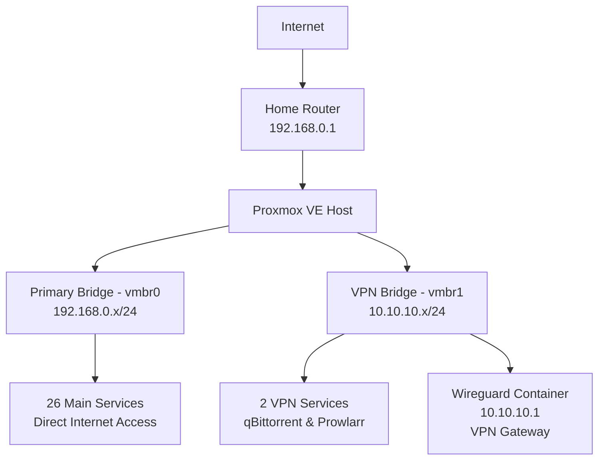
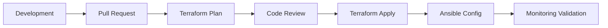

# Infrastructure Overview

This section provides a comprehensive view of the 28-container homelab infrastructure, built on Proxmox VE and managed through GitOps principles.

## 🏗️ Architecture Summary

The infrastructure consists of **28 LXC containers** organized into four main service categories, all managed through Infrastructure as Code using Terraform and Ansible.

### Service Distribution

<div class="architecture-stats">
  <div class="stat-card media">
    <div class="stat-number">9</div>
    <div class="stat-label">Media Stack</div>
    <div class="stat-desc">Plex, *arr automation, torrents</div>
  </div>
  
  <div class="stat-card monitoring">
    <div class="stat-number">9</div>
    <div class="stat-label">Monitoring</div>
    <div class="stat-desc">Grafana, Prometheus, Loki, alerts</div>
  </div>
  
  <div class="stat-card security">
    <div class="stat-number">4</div>
    <div class="stat-label">Security</div>
    <div class="stat-desc">SWAG, Wireguard, Vaultwarden</div>
  </div>
  
  <div class="stat-card business">
    <div class="stat-number">6</div>
    <div class="stat-label">Business</div>
    <div class="stat-desc">Odoo, Immich, Paperless, storage</div>
  </div>
</div>

## 🖥️ Platform Details

### Virtualization Layer
- **Platform**: Proxmox VE 8.14 on Linux 6.14.8-2-pve
- **Container Technology**: LXC (Linux Containers)
- **Host Resources**: 32GB RAM, 99% utilization optimization
- **Storage**: ZFS pool with 10TB shared data, 128GB Docker volumes

### Operating Systems
- **Debian 13 "Trixie"**: Primary OS for most containers
- **Ubuntu 25.04 "Plucky"**: Selected services requiring newer packages
- **Alpine 3.22.1**: Lightweight containers for efficiency

## 🌐 Network Architecture

### Dual Bridge Configuration



### Network Segmentation
- **Primary Network (vmbr0)**: `192.168.0.x/24` - All containers with direct internet
- **VPN Network (vmbr1)**: `10.10.10.x/24` - Isolated torrent traffic through Wireguard
- **Firewall Rules**: 10+ containers with specific port access controls

## 💾 Storage Configuration

### ZFS Storage Pool
- **Shared Data Volume**: 10TB for media and application data
- **Docker Volumes**: 128GB dedicated for containerized applications
- **Monitoring Storage**: Specialized 64GB volume for logs and metrics
- **Backup Strategy**: Automated snapshots with 7-day retention

### Mount Point Strategy
```
Container Mount Patterns:
├── /data          → 10TB shared storage (media, documents)
├── /docker        → 128GB container volumes  
├── /monitoring    → 64GB specialized logging storage
└── /backups       → Automated backup destinations
```

## 🔧 Resource Allocation

### High-Performance Containers
| Container | RAM | Cores | Special Features |
|-----------|-----|-------|------------------|
| Plex | 4GB | 2 | GPU passthrough, privileged |
| Immich | 4GB | 4 | GPU passthrough, privileged |
| Immich Backup | 9GB | 4 | Stopped by default |

### Standard Allocation
- **Media Services**: 512MB-2GB RAM, 1-2 cores
- **Monitoring Stack**: 256MB-2GB RAM optimized for efficiency  
- **Security Services**: 512MB-2GB RAM with network focus
- **Business Apps**: 1-2GB RAM for database-backed applications

## 🚀 GitOps Implementation

### Infrastructure as Code
- **Terraform**: Complete container definitions and resource allocation
- **Ansible**: Service configuration and application deployment
- **GitHub Actions**: Automated testing, planning, and deployment
- **Version Control**: All infrastructure changes tracked and reviewable

### Deployment Workflow


## 📊 Key Metrics

<div class="metrics-grid">
  <div class="metric">
    <div class="metric-value">99.9%</div>
    <div class="metric-label">Uptime</div>
  </div>
  <div class="metric">
    <div class="metric-value">30.75GB</div>
    <div class="metric-label">RAM Allocated</div>
  </div>
  <div class="metric">
    <div class="metric-value">103GB</div>
    <div class="metric-label">Storage Freed</div>
  </div>
  <div class="metric">
    <div class="metric-value">31 Days</div>
    <div class="metric-label">Log Retention</div>
  </div>
</div>

## 🔄 Automation Features

### Self-Healing Infrastructure
- **Automated Container Restart**: Failed services auto-recover
- **Resource Monitoring**: Proactive alerts at 90% thresholds
- **Backup Automation**: Daily snapshots with intelligent retention
- **Update Management**: Mass upgrade capability across all containers

### Intelligent Alerting
- **Critical Alerts** 🔴: Container failures, storage issues
- **Warning Alerts** 🟡: Resource thresholds, service degradation
- **Info Notifications** ℹ️: Deployment status, system updates
- **Success Confirmations** ✅: Backup completion, service recovery

<style>
.architecture-stats {
  display: grid;
  grid-template-columns: repeat(auto-fit, minmax(200px, 1fr));
  gap: 1rem;
  margin: 2rem 0;
}

.stat-card {
  padding: 1.5rem;
  border-radius: 8px;
  text-align: center;
  border: 2px solid var(--vp-c-divider);
}

.stat-card.media { border-color: #ff6b6b; }
.stat-card.monitoring { border-color: #4ecdc4; }  
.stat-card.security { border-color: #45b7d1; }
.stat-card.business { border-color: #96ceb4; }

.stat-number {
  font-size: 2.5rem;
  font-weight: bold;
  margin-bottom: 0.5rem;
}

.stat-label {
  font-weight: bold;
  margin-bottom: 0.5rem;
}

.stat-desc {
  font-size: 0.9rem;
  color: var(--vp-c-text-2);
}

.metrics-grid {
  display: grid;
  grid-template-columns: repeat(auto-fit, minmax(120px, 1fr));
  gap: 1rem;
  margin: 2rem 0;
}

.metric {
  text-align: center;
  padding: 1rem;
  background: var(--vp-c-bg-alt);
  border-radius: 8px;
}

.metric-value {
  font-size: 1.5rem;
  font-weight: bold;
  color: var(--vp-c-brand);
}

.metric-label {
  font-size: 0.9rem;
  color: var(--vp-c-text-2);
  margin-top: 0.5rem;
}
</style>