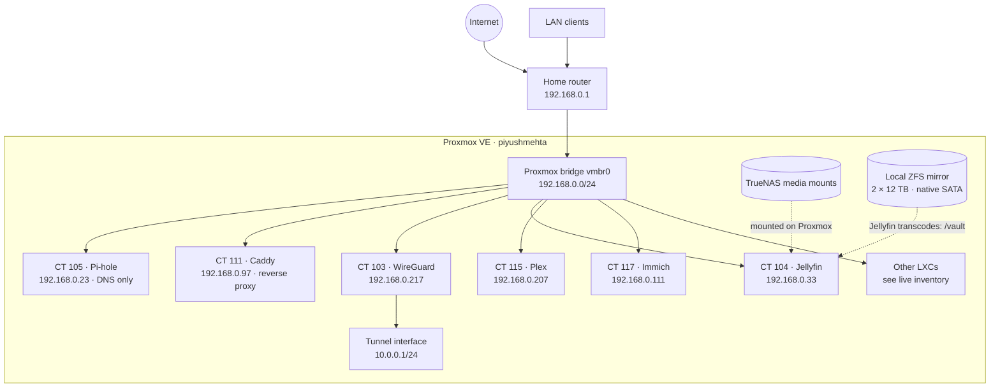

# Infrastructure Overview

Point-in-time view of the live Proxmox homelab, verified October 8, 2026. Runtime inventory is distinct from Terraform configuration; verify current state in Proxmox before changes.

## Current snapshot

**23 LXC containers: 16 running, 7 stopped.** See the [live container inventory](/infrastructure/containers) for addresses and states. This is not a deployment plan; review configuration drift before applying Terraform.

## Platform and network

- **Proxmox node:** `piyushmehta`.
- **LAN:** `192.168.0.0/24` on `vmbr0`; router `192.168.0.1`.
- **DNS:** Pi-hole CT 105 at `192.168.0.23`, DNS only.
- **Reverse proxy:** Caddy CT 111 at `192.168.0.97`.
- **VPN:** WireGuard CT 103 at `192.168.0.217`; tunnel interface `10.0.0.1/24`.

```mermaid
flowchart TB
    WAN((Internet)) --> R["Home router<br/>192.168.0.1"]
    CLIENTS["LAN clients"] --> R
    R --> BR["Proxmox bridge vmbr0<br/>192.168.0.0/24"]
    subgraph PVE["Proxmox VE · piyushmehta"]
        BR --> DNS["CT 105 · Pi-hole<br/>192.168.0.23 · DNS only"]
        BR --> CADDY["CT 111 · Caddy<br/>192.168.0.97 · reverse proxy"]
        BR --> WG["CT 103 · WireGuard<br/>192.168.0.217"]
        WG --> TUN["Tunnel interface<br/>10.0.0.1/24"]
        BR --> MEDIA["CT 104 · Jellyfin<br/>192.168.0.33"]
        BR --> PLEX["CT 115 · Plex<br/>192.168.0.207"]
        BR --> IMMICH["CT 117 · Immich<br/>192.168.0.111"]
        BR --> SERVICES["Other LXCs<br/>see live inventory"]
        TN[("TrueNAS media mounts")] -. "mounted on Proxmox" .-> MEDIA
        ZFS[("Local ZFS mirror<br/>2 × 12 TB · native SATA")] -. "Jellyfin transcodes: /vault" .-> MEDIA
    end
```

Dashed arrows show documented storage relationships, not a specific mount protocol. Caddy routes and external exposure are intentionally omitted; confirm them from live configuration.

## Storage

- TrueNAS media is mounted on Proxmox and passed to Jellyfin.
- Jellyfin transcodes use `/vault`.
- Local ZFS mirror: two 12 TB disks connected by native SATA.

## Source of truth

Proxmox inventory reports runtime state; Terraform describes intended configuration and can differ. Verify IPs and status in Proxmox, review drift, and inspect plans before applying. Hardware versions and unverified service mappings are omitted.

## Detailed container mapping

See the [complete live container inventory](/infrastructure/containers), including stopped containers.
