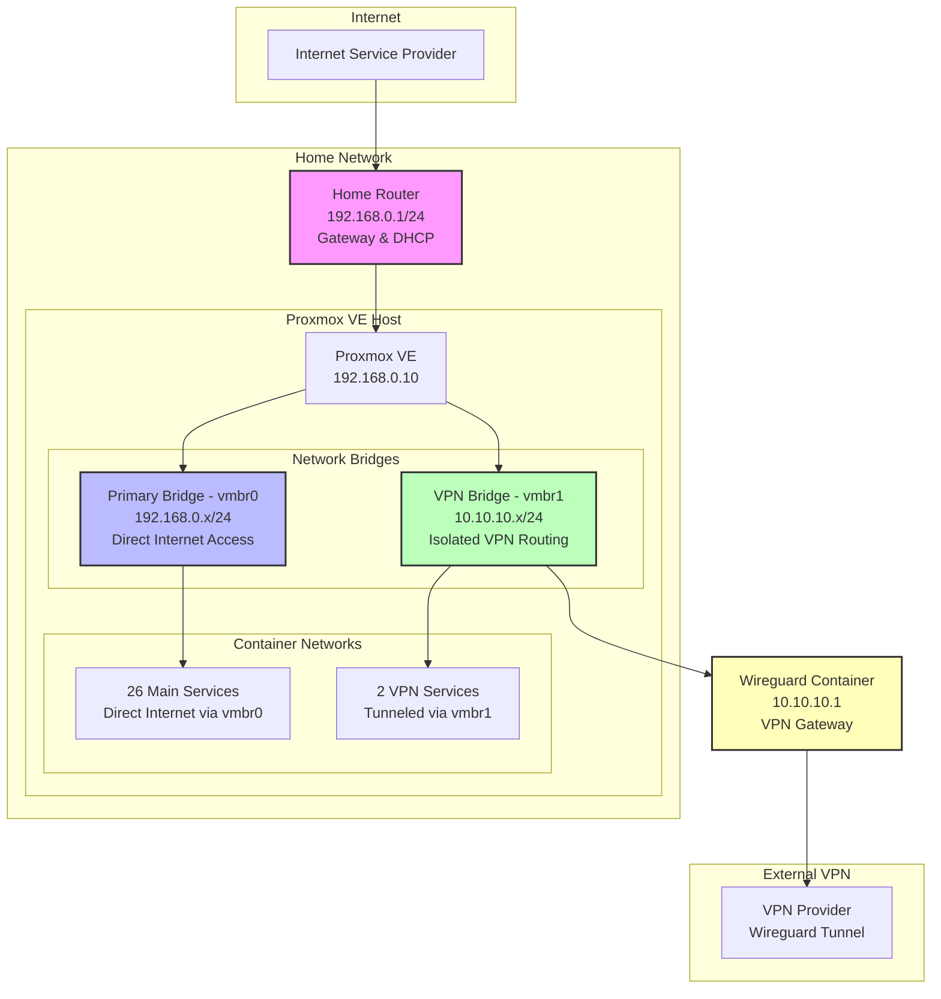
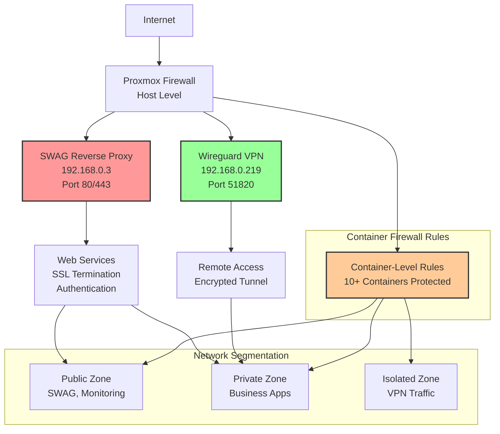
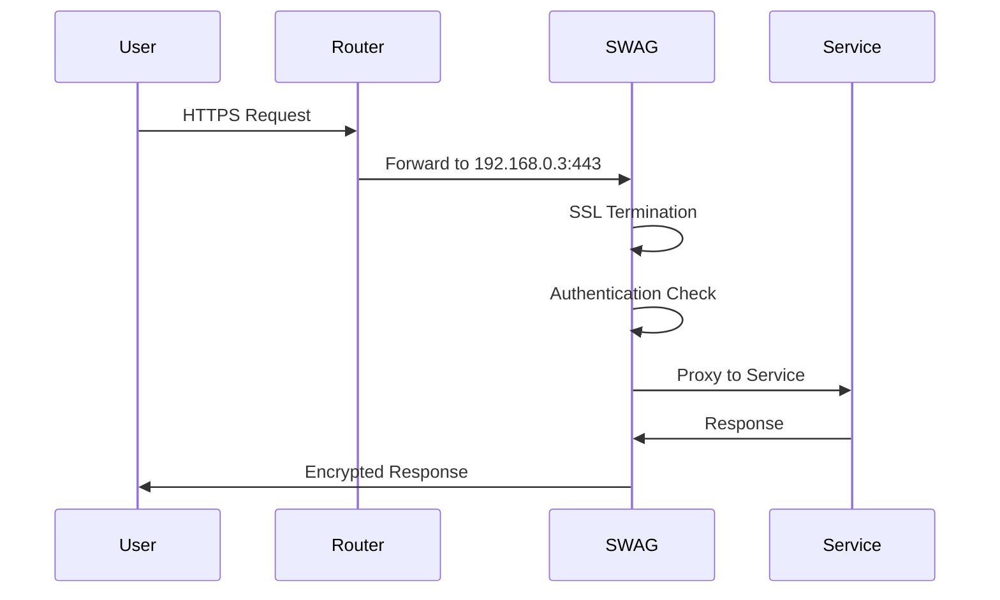
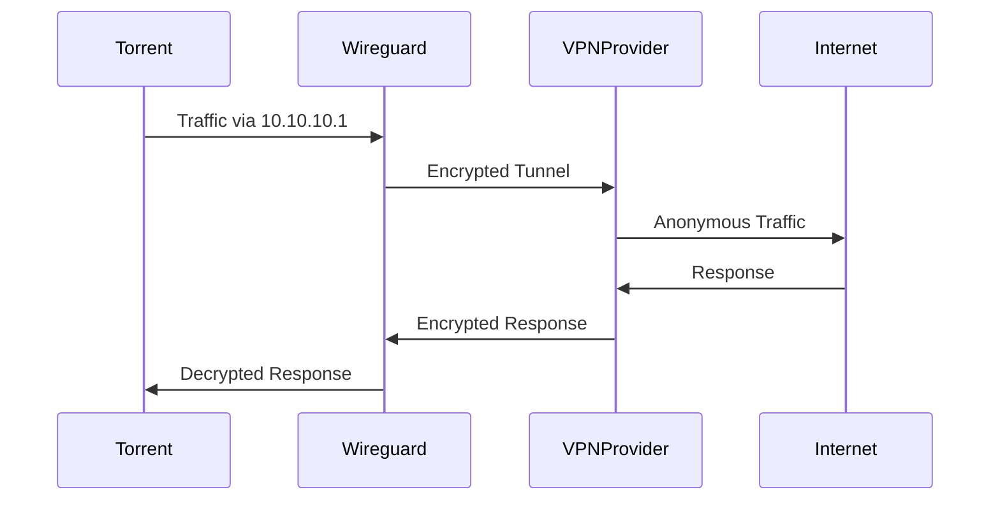
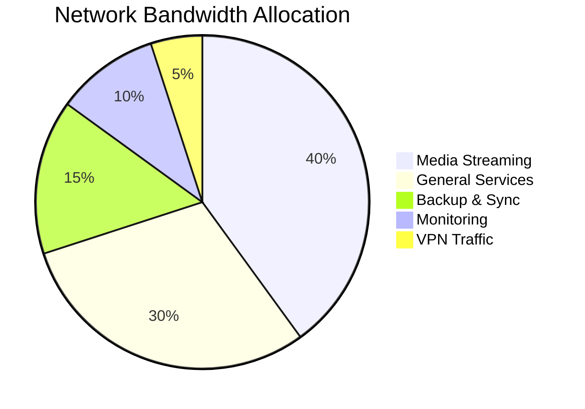

# Network Architecture

Comprehensive network design for the 28-container homelab infrastructure with dual-bridge configuration, VPN routing, and security segmentation.

## 🌐 Network Topology



## 🔧 Bridge Configuration

### Primary Bridge (vmbr0)
**Purpose**: Main network bridge for all standard services

```bash
# Configuration in /etc/network/interfaces
auto vmbr0
iface vmbr0 inet static
    address 192.168.0.10/24
    gateway 192.168.0.1
    bridge-ports enp6s0
    bridge-stp off
    bridge-fd 0
    dns-nameservers 1.1.1.1 1.0.0.1
```

**Connected Containers**: 26 containers with direct internet access
- **Media Stack**: Plex, Sonarr, Radarr, Lidarr, Overseerr, etc.
- **Monitoring**: Grafana, Prometheus, Loki, AlertManager, etc.
- **Security**: SWAG, Vaultwarden, RustDesk
- **Business**: Immich, Odoo, Paperless-ngx, File Server

### Secondary Bridge (vmbr1)  
**Purpose**: Isolated network for VPN-routed traffic

```bash
# Configuration in /etc/network/interfaces
auto vmbr1
iface vmbr1 inet static
    address 10.10.10.1/24
    bridge-ports none
    bridge-stp off
    bridge-fd 0
```

**Connected Containers**: 2 containers requiring VPN routing
- **qBittorrent** (10.10.10.2): Torrent client with VPN protection
- **Prowlarr** (10.10.10.3): Indexer management via VPN

## 🔒 Security Architecture



## 📊 IP Address Allocation

### Static IP Assignments
| Range | Purpose | Examples |
|-------|---------|----------|
| 192.168.0.1-50 | Infrastructure | Router (1), Proxmox (10), SWAG (3) |
| 192.168.0.51-150 | Core Services | Grafana (243), Plex (207), File Server (5) |
| 192.168.0.151-200 | Business Apps | Odoo (159), Paperless (149), Docker (153) |
| 192.168.0.201-250 | Monitoring | Loki (200), AlertManager (201), Blackbox (202) |

### Dynamic IP Range
- **DHCP Pool**: 192.168.0.100-150 (for containers using dynamic allocation)
- **Reserved**: 192.168.0.251-254 (future expansion)

### VPN Network (10.10.10.0/24)
| IP | Container | Purpose |
|----|-----------|---------|
| 10.10.10.1 | Wireguard | VPN Gateway |
| 10.10.10.2 | qBittorrent | Torrent Client |
| 10.10.10.3 | Prowlarr | Indexer Management |

## 🔄 Traffic Flow Patterns

### External Access Flow


### VPN Traffic Flow


## 🛡️ Firewall Configuration

### Host-Level Rules (Proxmox)
```bash
# Allow SSH (management)
iptables -A INPUT -p tcp --dport 22 -j ACCEPT

# Allow Proxmox Web UI
iptables -A INPUT -p tcp --dport 8006 -j ACCEPT

# Allow SWAG (HTTP/HTTPS)
iptables -A INPUT -p tcp --dport 80 -j ACCEPT
iptables -A INPUT -p tcp --dport 443 -j ACCEPT

# Allow Wireguard VPN
iptables -A INPUT -p udp --dport 51820 -j ACCEPT

# Allow monitoring (Grafana, Prometheus)
iptables -A INPUT -p tcp --dport 3000 -j ACCEPT
iptables -A INPUT -p tcp --dport 9090 -j ACCEPT
```

### Container-Level Firewall Rules
**Enabled for 10+ containers** with specific port access:

```yaml
Container Firewall Configuration:
  grafana:
    ports: [3000]
    access: internal + external
  
  plex:
    ports: [32400, 3005, 8324, 32469]
    access: internal + external
    
  immich:
    ports: [2283]
    access: internal + VPN only
    
  vaultwarden:
    ports: [8080]
    access: VPN only
```

## 📈 Network Performance

### Bandwidth Allocation
- **Total Capacity**: Gigabit (1000 Mbps)
- **Media Streaming**: 200-400 Mbps (Plex transcoding)
- **Backup Operations**: 100-200 Mbps (scheduled off-peak)
- **Monitoring Traffic**: 10-50 Mbps (metrics collection)
- **VPN Tunnel**: 50-100 Mbps (torrent traffic)

### Quality of Service (QoS)


## 🔧 Network Management

### DNS Configuration
- **Primary DNS**: 1.1.1.1 (Cloudflare)
- **Secondary DNS**: 1.0.0.1 (Cloudflare)
- **Internal Resolution**: Container hostnames via Docker networks

### Network Monitoring
- **Bandwidth**: Monitored via Prometheus + Grafana
- **Latency**: Blackbox Exporter for external endpoints
- **Connectivity**: Uptime Kuma for service availability
- **Security**: Log analysis via Loki for suspicious activity

### Troubleshooting Commands
```bash
# Check bridge status
brctl show

# Verify container networking
pct exec <id> -- ip addr show

# Test connectivity
ping -c 4 192.168.0.3  # SWAG
ping -c 4 10.10.10.1   # Wireguard

# Check routing
ip route show
ip route show table all

# Monitor traffic
iftop -i vmbr0
iftop -i vmbr1
```

This network architecture provides robust security, performance, and scalability while maintaining clear separation between different traffic types and security zones.