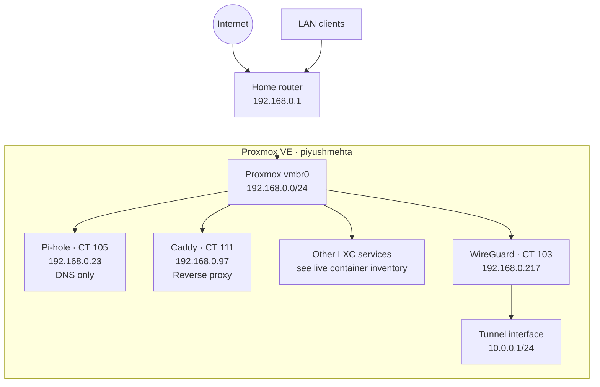

# Network Architecture

Verified Proxmox snapshot from October 8, 2026. Older diagrams describing a `10.10.10.0/24` secondary bridge do not match the current host: the documented Proxmox bridge is `vmbr0` on the home LAN. Confirm live routing and firewall configuration before making network changes.

## Topology

```mermaid
flowchart TB
    WAN((Internet)) --> ROUTER["Home router<br/>192.168.0.1"]
    CLIENTS["LAN clients"] --> ROUTER
    ROUTER --> BR["Proxmox vmbr0<br/>192.168.0.0/24"]
    subgraph HOST["Proxmox VE · piyushmehta"]
        BR --> DNS["Pi-hole · CT 105<br/>192.168.0.23<br/>DNS only"]
        BR --> PROXY["Caddy · CT 111<br/>192.168.0.97<br/>Reverse proxy"]
        BR --> SERVICES["Other LXC services<br/>see live container inventory"]
        BR --> WG["WireGuard · CT 103<br/>192.168.0.217"]
        WG --> TUN["Tunnel interface<br/>10.0.0.1/24"]
    end
```

## Verified network facts

- Home LAN: `192.168.0.0/24`; router: `192.168.0.1`.
- Proxmox LXC bridge: `vmbr0`.
- Pi-hole CT 105 (`192.168.0.23`) provides DNS only; it is not the gateway.
- Caddy CT 111 (`192.168.0.97`) is the reverse proxy. Its upstream mappings are not reproduced here.
- WireGuard CT 103 uses LAN address `192.168.0.217` and tunnel interface `10.0.0.1/24`.
- qBittorrent CT 204 (`192.168.0.43`) is currently on the LAN bridge; Prowlarr CT 201 is stopped.

## No verified second bridge

A previous version of this page described `vmbr1`, a `10.10.10.0/24` VPN subnet, and qBittorrent/Prowlarr at `10.10.10.2` and `.3`. That topology is stale. Do not use its bridge configuration or container addresses as deployment instructions. Consult the current Proxmox configuration before changing routes, bridges, DNS, or firewall rules.

## Runtime inventory

IP addresses and container state can change. See the [live container inventory](/infrastructure/containers) and verify in Proxmox before connecting to or operating a service. Caddy's exact external exposure and upstream routes are intentionally not asserted here.
