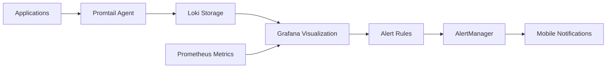

# Monitoring & Observability

Enterprise-grade monitoring stack providing comprehensive observability across the entire 28-container infrastructure with real-time alerting and centralized logging.

## 📊 Monitoring Architecture

The monitoring stack consists of **9 specialized containers** working together to provide complete infrastructure visibility:

<div class="monitoring-stack">
  <div class="monitor-card metrics">
    <div class="monitor-icon">📈</div>
    <div class="monitor-title">Metrics Collection</div>
    <div class="monitor-services">Prometheus, PVE Exporter</div>
  </div>
  
  <div class="monitor-card visualization">
    <div class="monitor-icon">📊</div>
    <div class="monitor-title">Visualization</div>
    <div class="monitor-services">Grafana, Glance Dashboard</div>
  </div>
  
  <div class="monitor-card logging">
    <div class="monitor-icon">📝</div>
    <div class="monitor-title">Centralized Logging</div>
    <div class="monitor-services">Loki, Promtail</div>
  </div>
  
  <div class="monitor-card alerting">
    <div class="monitor-icon">🚨</div>
    <div class="monitor-title">Intelligent Alerting</div>
    <div class="monitor-services">AlertManager, ntfy</div>
  </div>
  
  <div class="monitor-card external">
    <div class="monitor-icon">🌐</div>
    <div class="monitor-title">External Monitoring</div>
    <div class="monitor-services">Blackbox Exporter, Uptime Kuma</div>
  </div>
</div>

## 🏗️ Core Components

### Metrics & Time Series
- **Prometheus** (109): Primary metrics collection and storage
- **PVE Exporter** (106): Proxmox infrastructure metrics
- **Blackbox Exporter** (132): External endpoint monitoring
- **Node Exporters**: System-level metrics from all containers

### Visualization & Dashboards
- **Grafana** (110): Primary dashboard and visualization platform
- **Glance** (119): Lightweight status dashboard
- **Custom Dashboards**: Tailored views for each service category

### Centralized Logging
- **Loki** (130): Log aggregation and storage (31-day retention)
- **Promtail** (133): Log collection and shipping agent
- **Log Correlation**: Unified logging across all 28 containers

### Alerting & Notifications
- **AlertManager** (131): Intelligent alert routing and management
- **Uptime Kuma** (123): Service uptime monitoring
- **ntfy** (124): Mobile push notifications to iPhone

## 📱 Real-Time Alerting

### Alert Categories

<div class="alert-types">
  <div class="alert-card critical">
    <div class="alert-icon">🔴</div>
    <div class="alert-title">Critical</div>
    <div class="alert-desc">Container failures, storage full, service down</div>
  </div>
  
  <div class="alert-card warning">
    <div class="alert-icon">🟡</div>
    <div class="alert-title">Warning</div>
    <div class="alert-desc">90%+ resource usage, service degradation</div>
  </div>
  
  <div class="alert-card info">
    <div class="alert-icon">ℹ️</div>
    <div class="alert-title">Info</div>
    <div class="alert-desc">Deployment status, backup completion</div>
  </div>
  
  <div class="alert-card success">
    <div class="alert-icon">✅</div>
    <div class="alert-title">Success</div>
    <div class="alert-desc">Service recovery, successful operations</div>
  </div>
</div>

### Mobile Notifications
- **Instant Push**: Real-time alerts to iPhone via ntfy
- **Alert Grouping**: Intelligent bundling to prevent spam
- **Priority Routing**: Critical alerts bypass Do Not Disturb
- **Rich Content**: Detailed alert context with quick actions

## 📈 Key Metrics Tracked

### Infrastructure Metrics
```yaml
Host Resources:
  - CPU utilization across all cores
  - Memory usage and availability  
  - Disk space and I/O performance
  - Network throughput and latency

Container Health:
  - Container status and restarts
  - Resource consumption per container
  - Service response times
  - Application-specific metrics
```

### Application Metrics
```yaml
Media Stack:
  - Plex transcoding sessions
  - Download/upload rates
  - Storage usage trends
  - User activity patterns

Business Applications:
  - Database performance
  - User sessions
  - Document processing rates
  - Photo analysis progress

Security Services:
  - VPN connection status
  - Authentication attempts
  - Certificate expiration
  - Firewall rule matches
```

## 🔍 Advanced Monitoring Features

### Log Correlation


### Intelligent Alerting
- **Threshold-based Alerts**: CPU, memory, disk usage warnings
- **Service-specific Rules**: Application health checks
- **Trend Analysis**: Predictive alerting based on patterns
- **Alert Correlation**: Related events grouped together

### External Monitoring
- **Blackbox Exporter**: HTTP/HTTPS endpoint monitoring
- **DNS Resolution**: External DNS health checks  
- **Certificate Monitoring**: SSL certificate expiration tracking
- **Network Connectivity**: Latency and availability testing

## 📊 Dashboard Categories

### Infrastructure Overview
- **Host Resource Usage**: CPU, memory, disk, network
- **Container Status**: Health, resource consumption, restarts
- **Network Performance**: Bandwidth utilization, connection counts
- **Storage Analysis**: Disk usage, I/O performance, growth trends

### Service-Specific Dashboards
- **Media Stack**: Plex performance, download statistics, library metrics
- **Security Services**: VPN usage, authentication logs, certificate status
- **Business Applications**: ERP usage, document processing, photo analysis
- **GitOps Metrics**: Deployment success rates, pipeline performance

### Operational Dashboards
- **Alert Summary**: Current alerts, resolution times, trends
- **Backup Status**: Completion rates, storage usage, failure tracking
- **Update Management**: Package versions, security patches, system updates
- **Capacity Planning**: Growth projections, resource forecasting

## 🎯 Monitoring Best Practices

### Data Retention
- **Metrics**: 90 days of high-resolution data
- **Logs**: 31 days of centralized log retention
- **Alerts**: 30 days of alert history
- **Dashboards**: Automatic cleanup of old snapshots

### Performance Optimization
- **Efficient Queries**: Optimized PromQL for fast dashboards
- **Data Compression**: Loki compression for log storage
- **Resource Allocation**: Right-sized monitoring containers
- **Network Efficiency**: Local metric collection to minimize bandwidth

### Security & Access
- **Role-based Access**: Different dashboard views for different users
- **Secure Communication**: TLS encryption for all monitoring traffic
- **Audit Logging**: Complete access log for monitoring systems
- **Data Privacy**: Sensitive data filtering in logs and metrics

## 📱 Mobile Experience

### ntfy Integration
```yaml
Notification Channels:
  - homelab-critical: 🔴 Critical system alerts
  - homelab-warnings: 🟡 Performance warnings
  - homelab-info: ℹ️ Status updates
  - homelab-success: ✅ Operation confirmations

Features:
  - Push notifications with custom sounds
  - Rich text formatting and emojis
  - Action buttons for quick responses
  - Offline message queuing
```

### Real-world Examples
- **Container Failure**: "🔴 Plex container stopped - restarting automatically"
- **Storage Warning**: "🟡 Disk usage 85% on media storage - cleanup recommended"
- **Backup Success**: "✅ All 28 containers backed up successfully"
- **Update Available**: "ℹ️ Security updates available for 3 containers"

## 🔧 Maintenance & Operations

### Automated Maintenance
- **Log Rotation**: Automatic cleanup of old log files
- **Metrics Cleanup**: Removal of stale time series data
- **Dashboard Updates**: Automatic refresh of dynamic content
- **Alert Rule Validation**: Regular testing of alert conditions

### Health Checks
- **Self-Monitoring**: Monitoring stack monitors itself
- **Dependency Checks**: Validation of service dependencies
- **Data Quality**: Metrics and log ingestion validation
- **Performance Monitoring**: Monitoring system performance tracking

This comprehensive monitoring implementation provides enterprise-grade observability that ensures the 28-container homelab operates reliably with proactive issue detection and resolution capabilities.

<style>
.monitoring-stack {
  display: grid;
  grid-template-columns: repeat(auto-fit, minmax(200px, 1fr));
  gap: 1rem;
  margin: 2rem 0;
}

.monitor-card {
  padding: 1.5rem;
  border-radius: 8px;
  text-align: center;
  background: var(--vp-c-bg-alt);
  border: 2px solid var(--vp-c-divider);
}

.monitor-icon {
  font-size: 2rem;
  margin-bottom: 0.5rem;
}

.monitor-title {
  font-weight: bold;
  margin-bottom: 0.5rem;
}

.monitor-services {
  font-size: 0.9rem;
  color: var(--vp-c-text-2);
}

.alert-types {
  display: grid;
  grid-template-columns: repeat(auto-fit, minmax(150px, 1fr));
  gap: 1rem;
  margin: 2rem 0;
}

.alert-card {
  padding: 1rem;
  border-radius: 8px;
  text-align: center;
  background: var(--vp-c-bg-alt);
}

.alert-card.critical { border-left: 4px solid #ff4757; }
.alert-card.warning { border-left: 4px solid #ffa502; }
.alert-card.info { border-left: 4px solid #3742fa; }
.alert-card.success { border-left: 4px solid #2ed573; }

.alert-icon {
  font-size: 1.5rem;
  margin-bottom: 0.5rem;
}

.alert-title {
  font-weight: bold;
  margin-bottom: 0.5rem;
}

.alert-desc {
  font-size: 0.8rem;
  color: var(--vp-c-text-2);
}
</style>