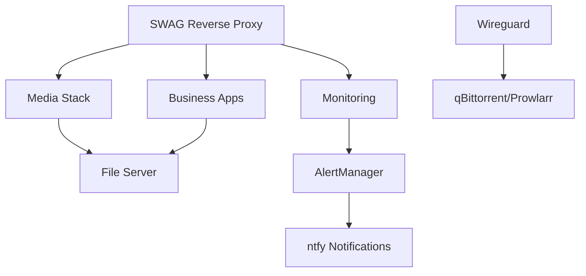

# Services Overview

Comprehensive overview of all 28 containerized services organized into four main categories, each serving specific purposes in the enterprise homelab ecosystem.

## 🎬 Media Stack (9 containers)

### Core Media Infrastructure
The media stack provides complete entertainment automation with GPU acceleration and VPN routing for privacy.

**🎭 Plex Media Server**
- **Purpose**: Central media server with transcoding
- **Features**: GPU passthrough, 4K transcoding, remote access
- **Integration**: Connects to all *arr services for content

**📺 Content Automation (*arr Stack)**
- **Sonarr**: TV show management and automation
- **Radarr**: Movie collection and quality management  
- **Lidarr**: Music library organization and search
- **Prowlarr**: Indexer management for all *arr services

**⬇️ Download Management**
- **qBittorrent**: Torrent client with web interface
- **AutoBrr**: RSS-based torrent automation
- **FlareSolverr**: Captcha solver for protected sites

**👥 User Interface**
- **Overseerr**: Media request management for users
- **Web interfaces**: All services accessible via SWAG reverse proxy

### Media Stack Features
- **4K/HDR Support**: Full hardware acceleration
- **Quality Profiles**: Automated quality management
- **VPN Protection**: Torrent traffic routed through Wireguard
- **Mobile Apps**: Native apps for all major platforms

---

## 📊 Advanced Monitoring (9 containers)

### Enterprise Observability
Complete monitoring solution providing metrics, logs, and alerts across all infrastructure.

**📈 Metrics & Visualization**
- **Prometheus**: Time-series metrics collection
- **Grafana**: Advanced dashboards and visualization
- **PVE Exporter**: Proxmox infrastructure metrics
- **Blackbox Exporter**: External endpoint monitoring

**📝 Centralized Logging**
- **Loki**: Log aggregation with 31-day retention
- **Promtail**: Log shipping agent across all containers
- **Log Correlation**: Unified logging with Grafana integration

**🚨 Intelligent Alerting**
- **AlertManager**: Smart alert routing and grouping
- **Uptime Kuma**: Service availability monitoring
- **ntfy**: Real-time mobile notifications

**📊 Dashboard Services**
- **Glance**: Lightweight status dashboard
- **Custom Dashboards**: Service-specific monitoring views

### Monitoring Capabilities
- **Real-time Metrics**: Sub-second monitoring resolution
- **Mobile Alerts**: iPhone push notifications via ntfy
- **Predictive Alerting**: Trend-based early warnings
- **Self-Monitoring**: Monitoring stack monitors itself

---

## 🔒 Security & Network (4 containers)

### Comprehensive Security Layer
Multi-layered security approach with network isolation, encryption, and access control.

**🌐 Network Security**
- **SWAG**: Reverse proxy with SSL termination
  - Let's Encrypt certificate automation
  - Fail2ban intrusion prevention
  - ModSecurity WAF protection
- **Wireguard**: VPN server for secure remote access
  - Dual network configuration (primary + VPN)
  - Mobile client support
  - Site-to-site connectivity

**🔐 Identity & Access**
- **Vaultwarden**: Self-hosted password manager
  - Bitwarden-compatible API
  - Secure credential sharing
  - Mobile app synchronization
- **RustDesk**: Remote desktop server
  - Self-hosted alternative to TeamViewer
  - Encrypted remote access
  - Cross-platform support

### Security Features
- **Zero-Trust Network**: All services behind SWAG
- **Certificate Management**: Automated SSL/TLS
- **Firewall Integration**: Container-level rules
- **Audit Logging**: Complete access tracking

---

## 🏢 Business & Storage (6 containers)

### Professional Applications
Business-grade applications for productivity, document management, and data storage.

**📸 Photo & Media Management**
- **Immich**: AI-powered photo management
  - GPU-accelerated face recognition
  - Smart photo organization
  - Mobile backup integration
  - Timeline and sharing features
- **Immich Backup**: Disaster recovery instance

**📄 Document Management**
- **Paperless-ngx**: Document digitization and OCR
  - Automated document processing
  - Full-text search capabilities
  - Tag-based organization
  - Email integration for scanning

**💼 Business Applications**
- **Odoo ERP**: Complete business management suite
  - CRM and sales management
  - Inventory and purchasing
  - Accounting and invoicing
  - Project management modules

**💾 Storage & Integration**
- **File Server**: Network-attached storage
  - SMB/CIFS shares
  - Cockpit web interface
  - User access controls
- **Google Drive**: Cloud storage synchronization
  - Automated backup integration
  - Selective sync capabilities

**📢 Communication**
- **ntfy**: Notification server
  - Push notifications to mobile devices
  - Topic-based messaging
  - Integration with all monitoring systems

### Business Features
- **AI Integration**: Photo recognition and document OCR
- **Mobile Access**: Native apps for all services
- **Data Protection**: Automated backups and versioning
- **Integration**: Services work together seamlessly

---

## 🌐 Service Integration

### Inter-Service Communication
Services are designed to work together as an integrated ecosystem:

### Common Integration Patterns
- **Authentication**: Single sign-on through SWAG
- **Storage**: Shared data volumes across related services  
- **Monitoring**: All services monitored by Prometheus
- **Notifications**: Critical events routed through ntfy
- **Networking**: Services communicate via Docker networks

## 🔧 Service Management

### Deployment Strategy
- **GitOps**: All services defined in Infrastructure as Code
- **Container Orchestration**: LXC containers managed by Terraform
- **Configuration Management**: Ansible for service configuration
- **Health Monitoring**: Continuous health checks and auto-recovery

### Maintenance Procedures
- **Automated Updates**: Scheduled security updates
- **Backup Automation**: Daily snapshots with retention policies
- **Log Rotation**: Automated cleanup of application logs
- **Performance Tuning**: Resource allocation optimization

### Access Methods
- **Web Interfaces**: All services accessible via browser
- **Mobile Apps**: Native applications where available
- **API Access**: RESTful APIs for automation
- **CLI Tools**: Command-line management utilities

This comprehensive service architecture provides enterprise-grade functionality while maintaining the flexibility and learning opportunities that make homelab environments valuable for skill development and experimentation.